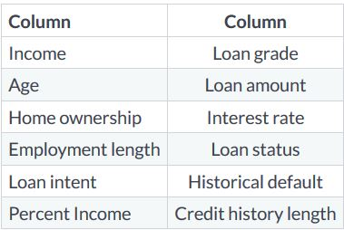
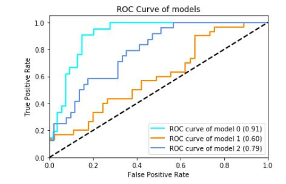
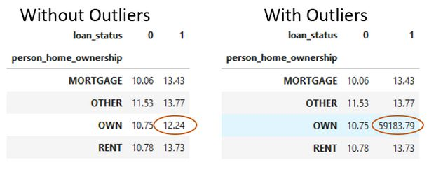

# Credit-Risk-Modeling
Prepare credit application data. After that, apply machine learning and business rules to reduce risk and ensure profitability.Ever applied for a credit card or loan, we know that financial firms process our information before making a decision. This is because giving us a loan can have a serious financial impact on their business. But how do they make a decision?

### Understanding credit risk
- Credit risk is the risk that someone who has borrowed money will not replay it all. Calculated risk is the difference between lending someone money and purchasing a government bond. With government bonds, it's almost guaranteed to be paid back, but not when lending money to people.
- A loan is in default when the lending agency is reasonably certain the loan will not be repaid. We will use ML model to determine this. Predicting this beforehand is useful for us to estimate expected loss.

#### Expected loss
- The amount that the firm loses as a result of the default on a loan.Expected loss is the simple calculation of **1) Probability of Default(PD), which is the likelihood that someone will default the loan**, **2) Exposure at Default(EAD) ,which is the amount outstanding at the time of default** ,**3) Loss Given Default(LGD), which is the ratio of the exposure against any recovery from the loss**
- e.g the 100 dollars we were owed is our exposure, and if we sell that debt for 20 dollars, our loss given default would be 80 percent. The formula for expected loss is probability of default times exposure at default and loss given default.
`expected_loss = PD * EAD *LGD`

#### Types of data used.
- For **modeling probablity of default (PD)** we generally have two primary types of data available. The first is the application data, which is data that is directly tied to the loan application like loan grade. The second is behavioral data, which describes the recipient of the loan, such as employment length.

|Application    | Behavioral        |
|---------------|-------------------|
| Interest Rate | Employment length |
| Grade         | Historical Default|
| Amount        | Income            |

#### Data Columns
- The data we will use for our predictions of PD includes a mix of behaviral and application. This is important because application data alone is not as good as application and behavioral data together.

<p align="center">
  
</p>

- These are two columns which emulate data that can be purchased from credit bureaus. Acquiring external data is a common practise in most organizations.
- Consider the percentage of income. This could effect loan status if the loan amount is more than their income, because they may not be able to afford payments.

#### EXploring with cross tables
- Our data has 32 thousand rows, which can be difficult to see all at once. Here is where we use cross tables using the crosstab function available within Pandas.We can use this function to help get a high level view of the data similar to pivot tables in Excel.

```python
pd.crosstab(cr_loan['person_home_ownership'], cr_loan['loan_status'], values=cr_loan['loan_int_rate'], aggfunc='mean').round(2)
```

#### Explore with visuals
- Inorder to using cross tables, we can explore the data set visually.Here we use matplotlib to create scatter plot of the loan's interest rate and the recipient's income.

```python
plt.scatter(cr_loan['person_income'], cr_loan['loan_int_rate'], c-'blue', alpha=0.5)
plt.xlabel("Personal Income")
plt.ylabel("Loan Interest Rate")
plt.show()
```

### Outliers in Credit Data

#### Data preprocessing
- In any ML problem, data preparation is the first step. When the data is properly processed we reduce the training time of our ML models.

<p align="center">
  
</p>

- Consider above ROC chart. This shows the accuracy of 3 different models on the same data throughout different stages of processing. The `light blue` line represents the model trained on tidy and prepared data, while the `orange` line's model trained on raw data. The `light blue` line represents the most accurate model, because the curve is closest to the top left corner.

#### Outliers and performance
- Possible causes of outliers
1. Problems with data entry systems (human errors)
2. Issues with data ingestion tools

#### Detecting outliers with cross tables
- Use cross tables with aggregate functions.

```python
pd.crosstab(cr_loan['person_home_ownership'], cr_loan['loan_status'],
        values=cr_loan['loan_int_rate'], aggfunc='mean').round(2)
```

<p align="center">
  
</p>

- Detecting outliers visually
1. Histogram
2. Scatter plots

#### Removing outliers
- `.drop()` from pandas can remove rows from our data

```python
indices = cr_loan[cr_loan['person_emp_length'] >= 60].index
cr_loan.drop(indices, inplace=True)
```

- In this example, we first use basic python subsetting to find rows with a person's employment length greater than 60.What this returns is the index position of that row in our dataframe. Then we drop rows whose employment length > 60.


