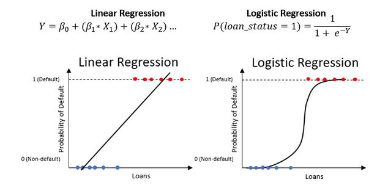
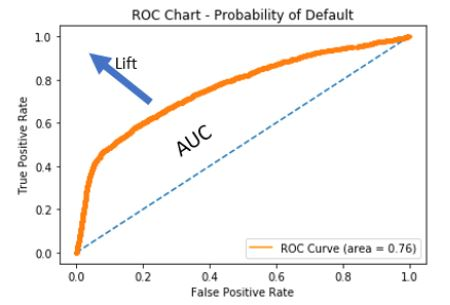
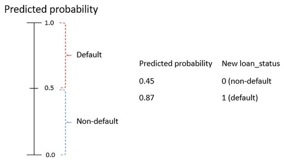
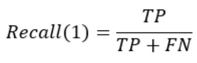

# Credit-Risk-Modeling
Prepare credit application data. After that, apply machine learning and business rules to reduce risk and ensure profitability.Ever applied for a credit card or loan, we know that financial firms process our information before making a decision. This is because giving us a loan can have a serious financial impact on their business. But how do they make a decision?

### Understanding credit risk
- Credit risk is the risk that someone who has borrowed money will not replay it all. Calculated risk is the difference between lending someone money and purchasing a government bond. With government bonds, it's almost guaranteed to be paid back, but not when lending money to people.
- A loan is in default when the lending agency is reasonably certain the loan will not be repaid. We will use ML model to determine this. Predicting this beforehand is useful for us to estimate expected loss.

#### Expected loss
- The amount that the firm loses as a result of the default on a loan.Expected loss is the simple calculation of **1) Probability of Default(PD), which is the likelihood that someone will default the loan**, **2) Exposure at Default(EAD) ,which is the amount outstanding at the time of default** ,**3) Loss Given Default(LGD), which is the ratio of the exposure against any recovery from the loss**
- e.g the 100 dollars we were owed is our exposure, and if we sell that debt for 20 dollars, our loss given default would be 80 percent. The formula for expected loss is probability of default times exposure at default and loss given default.
`expected_loss = PD * EAD *LGD`

#### Types of data used.
- For **modeling probablity of default (PD)** we generally have two primary types of data available. The first is the application data, which is data that is directly tied to the loan application like loan grade. The second is behavioral data, which describes the recipient of the loan, such as employment length.

|Application    | Behavioral        |
|---------------|-------------------|
| Interest Rate | Employment length |
| Grade         | Historical Default|
| Amount        | Income            |

#### Data Columns
- The data we will use for our predictions of PD includes a mix of behaviral and application. This is important because application data alone is not as good as application and behavioral data together.

<p align="center">
  
</p>

- These are two columns which emulate data that can be purchased from credit bureaus. Acquiring external data is a common practise in most organizations.
- Consider the percentage of income. This could effect loan status if the loan amount is more than their income, because they may not be able to afford payments.

#### EXploring with cross tables
- Our data has 32 thousand rows, which can be difficult to see all at once. Here is where we use cross tables using the crosstab function available within Pandas.We can use this function to help get a high level view of the data similar to pivot tables in Excel.

```python
pd.crosstab(cr_loan['person_home_ownership'], cr_loan['loan_status'], values=cr_loan['loan_int_rate'], aggfunc='mean').round(2)
```

#### Explore with visuals
- Inorder to using cross tables, we can explore the data set visually.Here we use matplotlib to create scatter plot of the loan's interest rate and the recipient's income.

```python
plt.scatter(cr_loan['person_income'], cr_loan['loan_int_rate'], c-'blue', alpha=0.5)
plt.xlabel("Personal Income")
plt.ylabel("Loan Interest Rate")
plt.show()
```

### Outliers in Credit Data

#### Data preprocessing
- In any ML problem, data preparation is the first step. When the data is properly processed we reduce the training time of our ML models.

<p align="center">
  
</p>

- Consider above ROC chart. This shows the accuracy of 3 different models on the same data throughout different stages of processing. The `light blue` line represents the model trained on tidy and prepared data, while the `orange` line's model trained on raw data. The `light blue` line represents the most accurate model, because the curve is closest to the top left corner.

#### Outliers and performance
- Possible causes of outliers
1. Problems with data entry systems (human errors)
2. Issues with data ingestion tools

#### Detecting outliers with cross tables
- Use cross tables with aggregate functions.

```python
pd.crosstab(cr_loan['person_home_ownership'], cr_loan['loan_status'],
        values=cr_loan['loan_int_rate'], aggfunc='mean').round(2)
```

<p align="center">
  
</p>

- Detecting outliers visually
1. Histogram
2. Scatter plots

#### Removing outliers
- `.drop()` from pandas can remove rows from our data

```python
indices = cr_loan[cr_loan['person_emp_length'] >= 60].index
cr_loan.drop(indices, inplace=True)
```

- In this example, we first use basic python subsetting to find rows with a person's employment length greater than 60.What this returns is the index position of that row in our dataframe. Then we drop rows whose employment length > 60.

### Risk with missing data in loan data
- With outliers now removed we can now focus on another problem with credit data and that is when data is missing. One issue with missing data is similar to problems caused bu outliers, in that it can negatively impact predictive model performance.
- It can bias our model in unanticipated ways, which can affect how we predict defaults.This could result in us predicting large number of defaults that are not actually defaults because the model is biased towards defaults.

#### Handle missing data
- Generally three ways to handle missing data
 1. Replacing a null with the average value of that column.
 2. Other times, we remove the row with missing data all together. For .eg. if there are nulls in loan amount, we should drop those rows entirely.
 3. Leave the rows with missing data unchanged.This however is not the case with loan data.
- Understanding the data will direct us towards one of these 3 actions. For e.g,if the loan status is null, it's possible that the loan was recently processed in the system. Sometimes there is a data delay, and additional time needed for processing.In this case, we should just remove the whole row.
- Another example is where the person's age is missing.Here, we might be able to replace the missing age values with the median of everyone's age.

#### Finding missing data
- Null values are easily found by using the `isnull()` function.
- Null records can be easily counted with the `sum()` function.
- `.any()` method checks all columns
- By combining the functions isnull, sum and any, we count all the null values in each column.This produces a tables of values that show the count of records with nulls in the data.

```python
null_columns = cr_loan.columns[cr_loan.isnull().any()]
cr_loan[null_columns].isnull().sum()
```

#### Replace missing data
- We can call the `.fillna()` with aggregate functions and methods.

```python
cr_loan['loan_int_rate'].fillna((cr_loan['loan_int_rate'].mean()), inplace=True)
```

- Here, we replace null interest rates with the average of all interest rates in the data.

#### Dropping missing data
- Uses indices to identify records the same as with outliers.
- Remove the records entirely using the `.drop()` method.

```python
indices = cr_loan[cr_loan['person_emp_length'].isnull()].index
cr_loan.drop(indices, inplace=True)
```

- Here, we find the rows with missing data using isnull, and then drop the rows from the dataset entirely.

### Logistic Regression for probability of default
- Now that we have removed outliers and missing data, we can begin modeling to predict the probabilty of default. The PD is the likelihood that someone will fail to repay a loan. This is expressed as a probability which is a value between zero and one.
- These probabilities are associated with our loan status column where a 1 is a default, and a 0 is a non default. The resulting predictions give us probabilities of default. The closer the value is to 1, the higher the probability of the loan being a default.
- To get these probabilities, we train ML models on our credit data columns known as features, so the models learn how to use the data to predict the probabilities. These types of models are known as classification models, where the class is default or non-default.
- In industry two models are used frequently, these are Logistic Regression and Decision trees. Both of these models can predict the probability of default, and tell us how important each column is for predictions.

#### Logistic regression
- Similar to linear regression, but only produces a value between 0 and 1.

<p align="center">
  
</p>

#### Training a Logistic Regression

```python
from sklearn.linear_model import LogisticRegression

clf_logistic = LogisticRegression(solver='lbfgs')
```

- The solver parameter is an optimizer, just like the solver in Excel. LBFGS is the default. To train the model we call the fit method on it. We use ravel from numpy to make the labels a one-dimensional array instead of a dataframe. In our data, the training columns are every column except the loan status.

```python
clf_logistic.fit(training_columns, np.ravel(training_labels))
```

### Credit Model Performance
- The easiest way to analyze performance is with accuracy. Accuracy is the number of correct predictions divided by the total number of predictions.

#### ROC curve charts
- ROC charts are a great way to visualize our model.They plot the `True positive rate (TPR)`, the percentage of correctly predicted defaults, against the `false positive rate`, the percentage of incorrectly predicted defaults. Using the `roc_curve` function in scikit-learn we create these two values and the thresholds all at once. From there, we use the normal line plots to see the results.

```python
fallout, sensitivity, thresholds = roc_curve(y_test, prob_default)
plt.plot(fallout, sensitivity, color='darkorange')
```

#### Analyzing ROC charts
- Area Under Curve(AUC) : area between curve and random prediction

<p align="center">
  
</p>

- The dotted blue line represents a random prediction and the orange line represents our model's predictions. ROC charts are interpreted by looking at how far away the model's curve gets from the dotted blue line shown here, which represents the random predictions. 
- **This movement away from the line is called lift**. The more lift we have, the larger the area under the curve gets.
- The **AUC** is the calculated area between the curve and the random prediction. This is a direct indicator of how well our model makes predictions.

#### Default(Class 1) thresholds
- To analyze performance further, we need to decide what probability range is a default, and what is a non-default.

<p align="center">
  
</p>

- Let's say, if any probability over 0.5 is default, and anything below that is a non-default. What this means is that we will assign a new loan_status to these loans based on their probability of default and the threshold. Once we have this, we can further check the model's performance.

#### Setting the threshold
- Once the threshold is defined we need to relabel our loans based on that threshold. For that, we will first need to create a variable to store the predicted probabilities. Then we can create a data frame from the second column which contains the probabilities of default. Then we apply a quick function to assign a value of 1 if the probability of default is above our threshold of 0.5. 

```python
preds = clf_logistic.predict_proba(X_test)
preds_df = pd.DataFrame(preds[:,1], columns = ['prob_default'])
preds_df['loan_status'] = preds_df['prob_default'].apply(lambda x:1 if x>0.5 else 0)
```

#### Credit classification reports
- Another really useful function for evaluating our models is the classification report function within sckit-learn. This shows several different evaluation metrics all at once. There are two useful metrics, precision and recall.

```python
from sklearn.metrics import classification_report
classification_report(y_test, preds_df['loan_status'], target_names=target_names)
```

#### Selecting classification metrics
- Select and store components from the `classification_report()`. Use the `precision_recall_fscore_support()` function from scikit-learn.

```python
from sklearn.metrics import precision_recall_fscore_support
precision_recall_fscore_support(y_test, preds_df['loan_status'])[1][1]
```

### Model discrimination and impact
- Another way to analyze our model's performance is with the confusion matrix. This will show us all of the correct and incorrect predictions for loan_status.

#### Default recall for loan status
- The definition of default recall, also called sensitivity, is the proportion of actual positives correctly predicted.

<p align="center">
  
</p>


